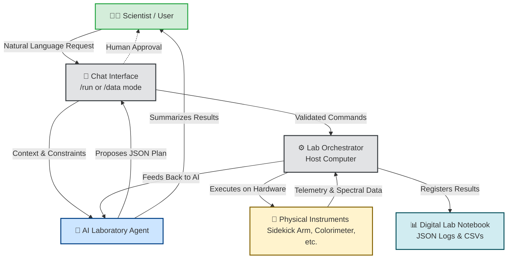

# Talos-SDL Orchestrator

**An open-source, agentic host framework for Self-Driving Laboratories (SDLs) and autonomous experimentation.**

Talos-SDL is designed to lower the barrier to entry for automated scientific experimentation. Rather than a rigid, top-down "Lab Operating System," Talos functions as a **collaborative digital peer**. It empowers researchers to rapidly build bespoke robotic instruments, integrate custom sensors, and execute AI-orchestrated workflows—all while natively digitizing the data collection process.

Whether you are performing automated titrations, running closed-loop materials discovery, or just want your robotic arm to do the pipetting for you, Talos handles the orchestration so you can focus on the chemistry.

## Core Philosophy & Features

*   **The AI as a Peer (Agentic REPL):** Interact with your lab equipment through a natural-language conversational loop. An integrated LLM agent acts as your co-pilot, translating your high-level scientific goals (e.g., *"Prepare a 1:1 mixture in well A1 and measure its spectrum"*) into structured, executable robotic plans.
*   **"Documentation-While-Doing":** Every human prompt, machine execution, and sensor measurement is captured in real-time. The framework inherently digitizes your workflow, creating a chronological, machine-readable JSON archive ready for machine learning and total reproducibility.
*   **Human-in-the-Loop (HITL) Safety:** To mitigate AI hallucinations and ensure safe operation, Talos enforces explicit human approval prompts, strict capability validation, and optional dry-runs before physical hardware ever actuates.
*   **Plug-and-Play Hardware (Decoupled Architecture):** Talos enforces a strict separation between the "Brain" (the Python host computer) and the "Hands" (microcontrollers running your hardware). They communicate via standardized, human-readable JSON over serial, making it incredibly easy to add new DIY instruments to your lab.

## How It Works

The framework operates on a simple, transparent workflow designed to keep the scientist in control:



## Project Structure

The repository is organized to separate the high-level AI logic from the low-level hardware control:

*   `host/`: The "Brain." Contains the Python application that runs on your PC. Includes the AI agentic loop (`ai/`), graphical user interfaces (`gui/`), and device management logic.
*   `firmware/`: The "Hands." Contains the CircuitPython code that runs on your microcontrollers (e.g., Raspberry Pi Pico). Includes specific modules for the `sidekick` robotic arm, `colorimeter`, and common libraries.
*   `shared_lib/`: Shared protocols and message definitions to ensure the Host and Firmware speak the exact same language.
*   `docs/`: Hardware design guidelines, wiring configurations, and architectural deep-dives.

## Getting Started

### 1. Prerequisites
- A PC running Python 3.8+
- An OpenAI, Anthropic, or Google Gemini API key (for the Agentic REPL).
- A CircuitPython-compatible microcontroller (e.g., Raspberry Pi Pico, Adafruit Feather) connected to your physical instrument.

### 2. Host Setup
Clone the repository and install the required Python packages:
```bash
git clone https://github.com/yourusername/talos-sdl.git
cd talos-sdl
pip install -r requirements.txt
```
*(Don't forget to set up your `.env` file with your API keys!)*

### 3. Deploying Firmware
Connect your CircuitPython device (it should appear as a USB drive named `CIRCUITPY`). Use the included deployment script to load the instrument's firmware onto the board. 

For example, to deploy the Sidekick robotic arm firmware to drive `D:`:
```bash
python deploy.py D: sidekick
```

### 4. Enter the Laboratory Cockpit
To start the AI-driven conversational loop, run the chat interface:
```bash
python host/ai/chat.py
```
*Tip: Type `/help` once inside the interface to see available commands, switch between `/run` (hardware control) and `/data` (analysis) modes, and view registered datasets.*

If you prefer to drive the lab manually without AI, you can launch the graphical user interface:
```bash
python run_mvc_app.py
```

## Building Your Own Instruments

Talos is designed to grow with your research. Adding a new custom instrument (like a hotplate, a pump array, or a custom sensor) does not require a degree in computer science. 

We use a "Question-Driven Design" philosophy. By answering a few simple questions about what your instrument does, what pins it uses, and what commands it should accept, you can quickly generate the required firmware using our templates (and even have an AI assist you in writing the boilerplate). 

Check out the `docs/design_protocols/` directory to learn how to seamlessly integrate your bespoke hardware into the Talos ecosystem.

## Contributing

Contributions are welcome! Whether you are designing new hardware modules, improving the AI reasoning loop, or finding bugs, please feel free to fork the repository and submit a pull request.

## License

This project is licensed under the[MIT License](LICENSE).
