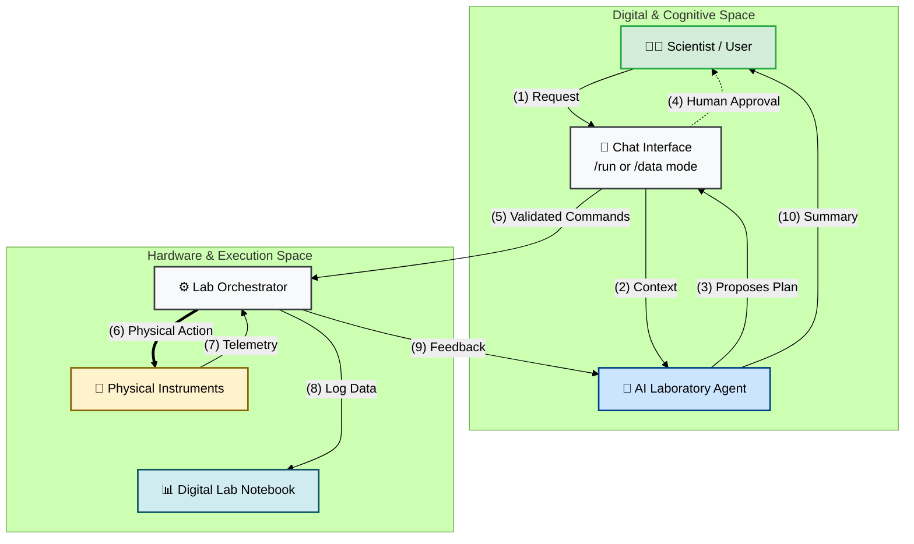
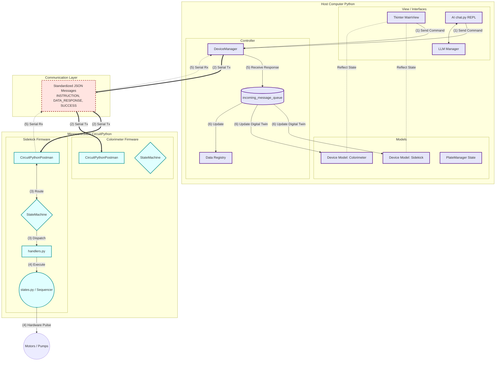

# Architecture

## Scientific workflow

```mermaid
%%{init: {
  'theme': 'forest',
  'themeVariables': {
    'edgeLabelBackground': '#eeeeee'
  }
} }%%
graph TD
    %% Styling (Forest theme provides defaults, but these classes refine them)
    classDef human fill:#d4edda,stroke:#28a745,stroke-width:2px;
    classDef ai fill:#cce5ff,stroke:#004085,stroke-width:2px;
    classDef system fill:#f8f9fa,stroke:#383d41,stroke-width:2px;
    classDef hardware fill:#fff3cd,stroke:#856404,stroke-width:2px;
    classDef data fill:#d1ecf1,stroke:#0c5460,stroke-width:2px;

    %% First Subgraph (Top)
    subgraph Cognitive_World [Digital & Cognitive Space]
        User[👨‍🔬 Scientist / User]:::human
        AI[🧠 AI Laboratory Agent]:::ai
        Chat[💬 Chat Interface <br/> /run or /data mode]:::system
    end

    %% Second Subgraph (Bottom)
    subgraph Physical_World [Hardware & Execution Space]
        Orchestrator[⚙️ Lab Orchestrator]:::system
        Instruments[🔬 Physical Instruments]:::hardware
        Data[📊 Digital Lab Notebook]:::data
        
        %% Columnar Ranking
        Orchestrator ~~~ Instruments ~~~ Data
    end

    %% Logic Flow
    User -- "(1) Request" --> Chat
    Chat -- "(2) Context" --> AI
    AI -- "(3) Proposes Plan" --> Chat
    Chat -. "(4) Human Approval" .-> User
    Chat -- "(5) Validated Commands" --> Orchestrator
    
    %% Execution & Feedback
    Orchestrator == "(6) Physical Action" ==> Instruments
    Instruments -- "(7) Telemetry" --> Orchestrator
    Orchestrator -- "(8) Log Data" --> Data
    Orchestrator -- "(9) Feedback" --> AI
    AI -- "(10) Summary" --> User
```

## Technical flowchart

```mermaid
flowchart TB
    %% Host Side
    subgraph Host_Computer [Host Computer Python]
        subgraph View [View / Interfaces]
            GUI[Tkinter MainView]
            REPL[AI chat.py REPL]
            AI_Agent[LLM Manager]
        end

        subgraph Controller [Controller]
            DM[DeviceManager]
            Queue[(incoming_message_queue)]
            Registry[Data Registry]
        end

        subgraph Model [Models]
            Dev1[Device Model: Sidekick]
            Dev2[Device Model: Colorimeter]
            Plate[PlateManager State]
        end

        GUI & REPL -->|"(1) Send Command"| DM
        REPL <--> AI_Agent
        DM -->|"(5) Receive Response"| Queue
        Queue -->|"(6) Update Digital Twin"| Dev1 & Dev2
        Queue -->|"(6) Update"| Registry
        Dev1 & Dev2 -. "Reflect State" .- GUI
    end

    %% The Bridge
    subgraph Comms [Communication Layer]
        JSON[Standardized JSON Messages<br/>INSTRUCTION, DATA_RESPONSE, SUCCESS]
    end

    %% Device Side
    subgraph Microcontrollers [Microcontrollers CircuitPython]
        subgraph FW1 [Sidekick Firmware]
            CP1[CircuitPythonPostman]
            SM1{StateMachine}
            Handlers1[handlers.py]
            States1((states.py / Sequencer))
        end
        
        subgraph FW2 [Colorimeter Firmware]
            CP2[CircuitPythonPostman]
            SM2{StateMachine}
        end
    end

    %% Connections
    DM == "(2) Serial Tx" ==> JSON
    JSON == "(2) Serial Tx" ==> CP1 & CP2
    
    CP1 <-->|"(3) Route"| SM1
    SM1 -->|"(3) Dispatch"| Handlers1
    Handlers1 -->|"(4) Execute"| States1
    States1 -->|"(4) Hardware Pulse"| Hardware1((Motors / Pumps))

    %% Return Path
    CP1 -.->|"(5) Serial Rx"| JSON
    JSON -.->|"(5) Serial Rx"| DM
    
    %% Styling
    classDef mvc fill:#e6e6fa,stroke:#4b0082,stroke-width:2px;
    classDef comms fill:#ffe4e1,stroke:#8b0000,stroke-width:2px,stroke-dasharray: 5 5;
    classDef fw fill:#e0ffff,stroke:#008b8b,stroke-width:2px;
    
    class GUI,REPL,AI_Agent,DM,Queue,Registry,Dev1,Dev2,Plate mvc;
    class JSON comms;
    class CP1,SM1,Handlers1,States1,CP2,SM2 fw;
```