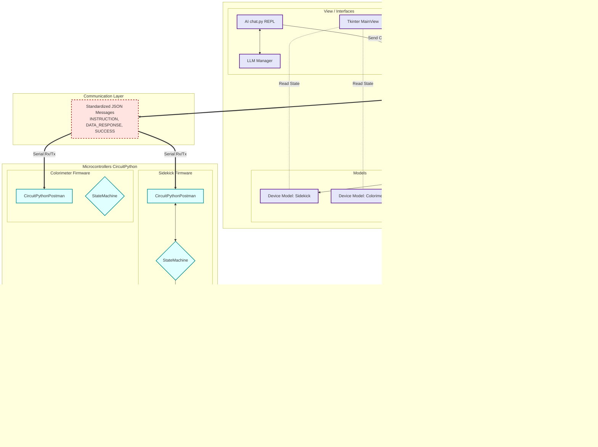

# Architecture

```mermaid
flowchart TB
    %% Host Side
    subgraph Host_Computer [Host Computer Python]
        subgraph View [View / Interfaces]
            GUI[Tkinter MainView]
            REPL[AI chat.py REPL]
            AI_Agent[LLM Manager]
        end

        subgraph Controller [Controller]
            DM[DeviceManager]
            Queue[(incoming_message_queue)]
            Registry[Data Registry]
        end

        subgraph Model [Models]
            Dev1[Device Model: Sidekick]
            Dev2[Device Model: Colorimeter]
            Plate[PlateManager State]
        end

        GUI & REPL -->|Send Command| DM
        REPL <--> AI_Agent
        DM -->|Spawns Threads| Queue
        Queue -->|Updates State| Dev1 & Dev2
        Queue -->|Triggers| Registry
        Dev1 & Dev2 -. "Read State" .- GUI
    end

    %% The Bridge
    subgraph Comms [Communication Layer]
        JSON[Standardized JSON Messages<br/>INSTRUCTION, DATA_RESPONSE, SUCCESS]
    end

    %% Device Side
    subgraph Microcontrollers [Microcontrollers CircuitPython]
        subgraph FW1 [Sidekick Firmware]
            CP1[CircuitPythonPostman]
            SM1{StateMachine}
            Handlers1[handlers.py]
            States1((states.py / Sequencer))
        end
        
        subgraph FW2 [Colorimeter Firmware]
            CP2[CircuitPythonPostman]
            SM2{StateMachine}
        end
    end

    %% Connections
    DM == "Serial Rx/Tx" ==> JSON
    JSON == "Serial Rx/Tx" ==> CP1 & CP2
    
    CP1 <--> SM1
    SM1 -->|Routes Payload| Handlers1
    Handlers1 -->|Sets Target Flags| States1
    States1 -->|Hardware IO| Hardware1((Motors / Pumps))
    
    %% Styling
    classDef mvc fill:#e6e6fa,stroke:#4b0082,stroke-width:2px;
    classDef comms fill:#ffe4e1,stroke:#8b0000,stroke-width:2px,stroke-dasharray: 5 5;
    classDef fw fill:#e0ffff,stroke:#008b8b,stroke-width:2px;
    
    class GUI,REPL,AI_Agent,DM,Queue,Registry,Dev1,Dev2,Plate mvc;
    class JSON comms;
    class CP1,SM1,Handlers1,States1,CP2,SM2 fw;
```