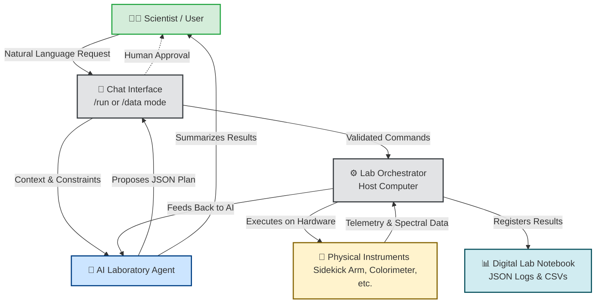

# Core Philosophy & Features

Talos-SDL is an open-source, agentic host framework designed to lower the barrier to entry for automated scientific experimentation. It functions as a **collaborative digital peer**, empowering researchers to rapidly build bespoke robotic instruments, integrate custom sensors, and execute AI-orchestrated workflows, all while natively digitizing the data collection process.

## Core Philosophy

Our design and development are guided by several core principles:

*   **The AI as a Peer (Agentic REPL):** Researchers can interact with lab equipment through a natural-language conversational loop. An integrated LLM agent acts as a co-pilot, translating high-level scientific goals (e.g., *"Prepare a 1:1 mixture in well A1 and measure its spectrum"*) into structured, executable robotic plans.
*   **"Documentation-While-Doing":** Every human prompt, machine execution, and sensor measurement is captured and logged. The framework inherently digitizes your workflow, creating a chronological, machine-readable JSON archive ready for machine learning and total reproducibility.
*   **Human-in-the-Loop (HITL) Safety:** To mitigate AI hallucinations and ensure safe operation, Talos enforces explicit human approval prompts, strict capability validation, and optional dry-runs before physical hardware ever actuates.
*   **Plug-and-Play Hardware (Decoupled Architecture):** Talos enforces a strict separation between the "Brain" (the Python host computer) and the "Hands" (microcontrollers running your hardware). They communicate via standardized, human-readable JSON over serial, making it incredibly easy to add new DIY instruments to your lab.

## How It Works

The framework operates on a simple, transparent workflow designed to keep the scientist in control. The following diagram illustrates the flow of a typical interaction:

## The Backronym

While Talos-SDL wasn't originally designed as an acronym, it aptly describes the system's nature:

**TALOS‑SDL stands for: Transparent Abstracted Layered Orchestration System — Self‑Driving Laboratory.**

*   It is **Transparent** because every action — human, agent, or hardware — is logged chronologically and made visible.
*   It is **Abstracted** because hardware, firmware, capabilities, and vendor details are hidden behind uniform digital twins and protocols.
*   It is **Layered** because the architecture is a vertically tiered stack of reasoning, planning, control, firmware, and hardware subsystems.
*   It is an **Orchestration System** because it coordinates these layers coherently, deterministically, and safely.
*   And it serves a **Self‑Driving Laboratory,** enabling autonomous experimentation while maintaining safety, reproducibility, and modularity.

